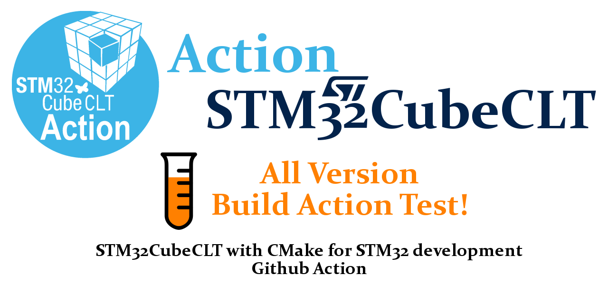

<!-- markdownlint-disable MD033 MD041 -->

  

  
  
  
  
  

<!-- markdownlint-enable MD033 MD041 -->

This repository provides **comprehensive compatibility testing** for the [uoohyo/action-stm32-cmake](https://github.com/marketplace/actions/build-with-stm32cubeclt-command-line-tools-using-cmake) GitHub Action across all released versions.

<!-- TEST_RESULTS_START -->

## Test Results

This table shows the build status for all tested STM32CubeCLT versions:

| STM32CubeCLT Version | Build Status | Configurations | Last Updated | Details |
|----------------------|--------------|----------------|--------------|---------|
| v1.21.0 |  | Debug, Release | 2026-05-18 | [Logs](https://github.com/uoohyo/action-stm32-cmake-sample/actions/runs/26008922266) |
| v1.20.0 |  | Debug, Release | 2026-05-18 | [Logs](https://github.com/uoohyo/action-stm32-cmake-sample/actions/runs/26008922259) |
| v1.19.0 |  | Debug, Release | 2026-05-18 | [Logs](https://github.com/uoohyo/action-stm32-cmake-sample/actions/runs/26008922269) |
| v1.18.0 |  | Debug, Release | 2026-05-18 | [Logs](https://github.com/uoohyo/action-stm32-cmake-sample/actions/runs/26008922265) |
| v1.17.0 |  | Debug, Release | 2026-05-18 | [Logs](https://github.com/uoohyo/action-stm32-cmake-sample/actions/runs/26008922276) |
| v1.16.0 |  | Debug, Release | 2026-05-18 | [Logs](https://github.com/uoohyo/action-stm32-cmake-sample/actions/runs/26008922254) |
| v1.15.1 |  | Debug, Release | 2026-05-18 | [Logs](https://github.com/uoohyo/action-stm32-cmake-sample/actions/runs/26008922271) |
| v1.15.0 |  | Debug, Release | 2026-05-18 | [Logs](https://github.com/uoohyo/action-stm32-cmake-sample/actions/runs/26008922256) |
| v1.14.0 |  | Debug, Release | 2026-05-18 | [Logs](https://github.com/uoohyo/action-stm32-cmake-sample/actions/runs/26008922267) |
| v1.13.0 |  | Debug, Release | 2026-05-18 | [Logs](https://github.com/uoohyo/action-stm32-cmake-sample/actions/runs/26008922258) |
| v1.12.1 |  | Debug, Release | 2026-05-18 | [Logs](https://github.com/uoohyo/action-stm32-cmake-sample/actions/runs/26008922257) |
| v1.12.0 |  | Debug, Release | 2026-05-18 | [Logs](https://github.com/uoohyo/action-stm32-cmake-sample/actions/runs/26008922252) |
| v1.11.1 |  | Debug, Release | 2026-05-18 | [Logs](https://github.com/uoohyo/action-stm32-cmake-sample/actions/runs/26008922262) |

<!-- TEST_RESULTS_END -->

## Purpose

Automatically verify that action-stm32-cmake works correctly across various versions of STM32CubeCLT (Command Line Tools). When new STM32CubeCLT versions are released, workflow tests are automatically generated and build tests are performed.

## Key Features

- **Automated Version Discovery**: Automatically detect new STM32CubeCLT versions via GitHub Releases API
- **Single-Project Testing**: One CMake project tests all action versions for consistent validation
- **Comprehensive Testing**: Coverage of 13 STM32CubeCLT versions (v1.11.1 ~ v1.21.0)
- **Continuous Integration**: Automatic build testing for all versions on push to main branch
- **Real-Time Status Dashboard**: Check build status for each version in the table below

## Target Configuration

- **Device**: STM32F103C8T6 (ARM Cortex-M3, 64KB Flash, 20KB RAM)
- **Manufacturer**: STMicroelectronics
- **Output Format**: ELF (Executable and Linkable Format)
- **Build Configurations**: Debug, Release
- **Toolchain**: ARM GNU Toolchain (arm-none-eabi-gcc)
- **Build System**: CMake 3.22+ with Ninja generator

## License

[MIT License](./LICENSE)

Copyright (c) 2024-2026 [uoohyo](https://github.com/uoohyo)

Permission is hereby granted, free of charge, to any person obtaining a copy
of this software and associated documentation files (the "Software"), to deal
in the Software without restriction, including without limitation the rights
to use, copy, modify, merge, publish, distribute, sublicense, and/or sell
copies of the Software, and to permit persons to whom the Software is
furnished to do so, subject to the following conditions:

The above copyright notice and this permission notice shall be included in all
copies or substantial portions of the Software.

THE SOFTWARE IS PROVIDED "AS IS", WITHOUT WARRANTY OF ANY KIND, EXPRESS OR
IMPLIED, INCLUDING BUT NOT LIMITED TO THE WARRANTIES OF MERCHANTABILITY,
FITNESS FOR A PARTICULAR PURPOSE AND NONINFRINGEMENT. IN NO EVENT SHALL THE
AUTHORS OR COPYRIGHT HOLDERS BE LIABLE FOR ANY CLAIM, DAMAGES OR OTHER
LIABILITY, WHETHER IN AN ACTION OF CONTRACT, TORT OR OTHERWISE, ARISING FROM,
OUT OF OR IN CONNECTION WITH THE SOFTWARE OR THE USE OR OTHER DEALINGS IN THE
SOFTWARE.
